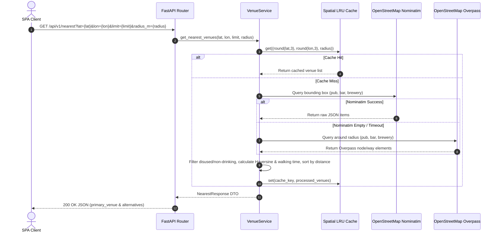

# PubFinder Backend API Architecture

This document describes the operational architecture, runtime data processing, spatial caching mechanisms, and integration pipelines of the **PubFinder API** backend service.

---

## 🛰️ Architecture & Lifecycle Overview

The PubFinder Backend API functions as a stateless geospatial proxy and normalization service. It receives user WGS84 coordinates (latitude and longitude), queries external OpenStreetMap providers, filters non-relevant venues, normalizes spatial metadata, and returns sorted venue responses.

---

## ⚡ Core Subsystems & Technical Mechanics

### 1. Request Lifecycle & Connection Pooling
- **Application Lifespan**: On application startup (`lifespan` in `app/factory.py`), a single shared `httpx.AsyncClient` instance is initialized with configurable timeouts and HTTP keep-alive settings.
- **Socket Reuse**: All outgoing HTTP requests to OpenStreetMap endpoints reuse pooled TCP connections, preventing socket exhaustion and lowering query latency.
- **Graceful Shutdown**: On process termination, active sockets in the connection pool are drained and closed cleanly.

---

### 2. Spatial Grid Rounding & LRU Caching
- **Grid Resolution**: Coordinates are rounded to **3 decimal places** (`round(lat, 3)`, `round(lon, 3)`). At middle latitudes, 0.001 degrees corresponds to approximately **111 meters** North-South and **70–80 meters** East-West.
- **Cache Key Schema**: Tuple hash `(rounded_lat, rounded_lon, radius_m)`. Nearby queries originating within the same ~100m grid cell share identical cache entries.
- **Cache Policy**: An in-memory Least Recently Used (LRU) cache with Time-To-Live (TTL) invalidation (`SpatialLRUCacheRepository`). Stale cache entries expire automatically after `CACHE_TTL_SECONDS` (default: 900s / 15 minutes).

---

### 3. OpenStreetMap Ingress & Failover Pipeline
- **Primary Search (Nominatim)**: Queries `nominatim.openstreetmap.org` using a calculated bounding box (`viewbox`) around the user's location ($\pm 0.035^\circ \approx 3.8\text{km}$). Queries `pub`, `bar`, and `brewery` amenities in parallel.
- **Fallback Search (Overpass)**: If Nominatim returns no items or experiences network errors, the engine fails over to an Overpass API query (`node["amenity"="pub"]`, `node["amenity"="bar"]`, `node["craft"="brewery"]`).
- **User-Agent Compliance**: Outgoing headers specify a descriptive `User-Agent` (`PubFinder/1.0 (...)`) to comply with OpenStreetMap Usage Policies.

---

### 4. Venue Filtering & Normalization Rules
1. **Name Enforcement**: Venues without a valid `name` tag or displaying empty labels are discarded.
2. **Category Filtering**: Excludes non-drinking establishments (e.g., `coffee`, `juice`, `milk`, `shisha`).
3. **Operational Filtering**: Discards elements tagged with `disused=yes` or `abandoned=yes`.
4. **Deduplication**: Tracks unique element IDs (`osm-node-{id}` or `osm-way-{id}`) to prevent duplicate entries when bounding boxes overlap.
5. **Address Assembly**: Constructs structured physical addresses by combining `road`, `city`/`town`/`village`, and `postcode`.
6. **Distance & Metric Calculations**:
   - **Haversine Distance**: Computes great-circle spherical distance in meters between user coordinates and venue coordinates.
   - **Walking Time**: Estimated at an average pace of $80\text{ meters/minute} \approx 4.8\text{ km/h}$, with a minimum lower bound of 1 minute (`ceil(distance / 80)`).
   - **Navigation Link**: Generates direct Google Maps direction URLs (`https://www.google.com/maps/dir/?api=1&destination={lat},{lon}`).

---

### 5. Error Handling & Observability
- **504 Gateway Timeout**: Raised if both Nominatim and Overpass fail to return venue data, signaling to the client SPA that external spatial providers are overloaded.
- **422 Unprocessable Entity**: Raised automatically by Pydantic for out-of-range coordinates ($\text{lat} \notin [-90, 90]$ or $\text{lon} \notin [-180, 180]$).
- **Structured Logging**: Outputs execution timings, spatial cache HIT/MISS events, and provider failover alerts in JSON or standard stream formats.

---

## ⚙️ Configuration Parameters

Key runtime settings managed via environment variables:

| Environment Variable | Default | Purpose |
| :--- | :--- | :--- |
| `HOST` | `0.0.0.0` | Server bind host address |
| `PORT` | `8080` | Server bind port |
| `NOMINATIM_URL` | `https://nominatim.openstreetmap.org/search` | OpenStreetMap Nominatim endpoint |
| `OVERPASS_URL` | `https://overpass-api.de/api/interpreter` | OpenStreetMap Overpass interpreter endpoint |
| `HTTP_TIMEOUT_SECONDS` | `6.0` | Timeout threshold for external HTTP provider requests |
| `CACHE_TTL_SECONDS` | `900` | In-memory spatial cache time-to-live (15 minutes) |
| `CACHE_MAX_SIZE` | `1000` | Maximum number of cached spatial grid cells |
| `JSON_LOGS` | `False` | Toggle structured JSON output vs human-readable logs |
