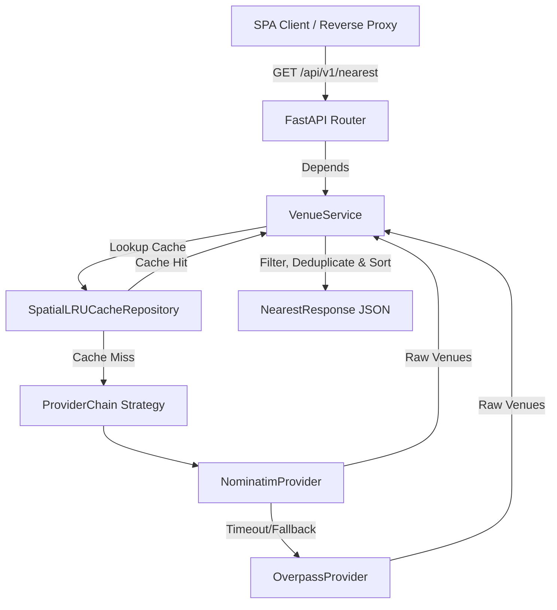

# PubFinder Backend API Architecture & Design

This document details the software architecture, design patterns, domain models, and developer workflows for the **PubFinder API** (`pubfinder-api`) backend service.

---

## 🏛️ System Overview

The PubFinder Backend API is a high-performance, stateless location-aware venue ingress engine and OpenStreetMap proxy service. It ingests raw spatial data, filters out non-relevant establishments, normalizes physical addresses, calculates precise Haversine walking distances, and returns clean JSON payloads to the frontend SPA.



---

## 🧩 Architectural Layers & Component Decomposition

```
backend/
├── pyproject.toml              # Ruff, Mypy, & Pytest tool configuration
├── Makefile                    # Developer CLI targets (lint, typecheck, format, test)
├── requirements.txt            # Dependency specification
├── main.py                     # Lean process entrypoint (args, logging, Uvicorn runner)
├── app/
│   ├── factory.py              # Application Factory (FastAPI, CORS, Lifespan context)
│   ├── core/
│   │   ├── config.py           # Pydantic BaseSettings (environment vars, defaults)
│   │   └── logging.py          # Structured JSON & console logger configuration
│   ├── schemas/                # Domain & API Data Transfer Objects (Strict Pydantic v2)
│   │   ├── address.py          # Address schema
│   │   ├── coordinates.py      # Coordinates schema
│   │   ├── opening_status.py   # OpeningStatus schema
│   │   ├── venue.py            # Venue schema
│   │   └── response.py         # NearestResponse & HealthResponse schemas
│   ├── providers/              # Strategy / Provider Pattern for External Data
│   │   ├── base.py             # Abstract Base Class (BaseGeospatialProvider)
│   │   ├── nominatim.py        # OpenStreetMap Nominatim Provider Implementation
│   │   ├── overpass.py         # OpenStreetMap Overpass Provider Implementation
│   │   └── chain.py            # Composite ProviderChain Strategy
│   ├── cache/                  # Repository Pattern for Spatial Caching
│   │   ├── base.py             # BaseCacheRepository Interface
│   │   └── memory.py           # SpatialLRUCacheRepository (TTLCache)
│   ├── services/               # Core Business Logic Layer
│   │   ├── geo.py              # Pure Haversine distance & walking time math
│   │   └── venue_service.py    # Venue ingestion, filtering, deduplication, & sorting
│   └── api/                    # Presentation / Controller Layer
│       ├── deps.py             # FastAPI Dependency Injection
│       ├── router.py           # Main API router registration
│       └── v1/endpoints/       # Endpoint handlers (/health, /api/v1/nearest)
└── tests/                      # Pytest suite
    ├── conftest.py             # Async client fixtures & mock providers
    ├── test_geo.py             # Unit tests for Haversine math
    ├── test_health.py          # Integration tests for /health
    └── test_venues.py          # Integration tests for /api/v1/nearest
```

---

## 🎨 Design Patterns & Engineering Principles

### 1. Strategy Pattern (`app/providers/`)
- **`BaseGeospatialProvider` (Abstract Base Class)**: Defines the common interface `async def fetch_venues(lat: float, lon: float, radius_m: int) -> list[RawVenueData]`.
- **`NominatimProvider`**: Implements high-speed bounding-box search queries (~0.25s response time).
- **`OverpassProvider`**: Implements secondary fallback queries for Overpass API nodes and ways.
- **`ProviderChain`**: Executes sequential queries with automatic failover if the primary provider times out or returns empty results.
- **Extensibility**: Adding new data sources (e.g. Mapbox, Google Places, custom GeoJSON) only requires subclassing `BaseGeospatialProvider` without altering business logic or API endpoints.

### 2. Repository Pattern for Spatial Caching (`app/cache/`)
- **`BaseCacheRepository` (Interface)**: Defines `get`, `set`, and `clear` cache operations.
- **`SpatialLRUCacheRepository`**: Implements in-memory spatial grid caching (~100m coordinate rounding).
- **Decoupling**: Swapping the in-memory cache for Redis or Memcached in production requires zero changes to business services.

### 3. Domain Service Layer (`app/services/`)
- **`GeoService`**: Contains pure mathematical calculations (Haversine distance, walking time estimations, Google Maps URL generation).
- **`VenueService`**: Coordinates data fetching, enforces business rules (filtering disused or non-drinking establishments), formats addresses, deduplicates entries by OpenStreetMap element IDs, and sorts venues by proximity.

### 4. Application Factory & Connection Pooling (`app/factory.py`)
- **`create_app()`**: Factory function building the FastAPI application instance.
- **Lifespan Context Manager**: Manages a single, shared `httpx.AsyncClient` connection pool across the application lifecycle to optimize socket reuse and lower latency.

### 5. Dependency Injection (`app/api/deps.py`)
- Endpoints inject services via FastAPI's `Depends()`, enabling straightforward unit testing with mock providers.

---

## 🛠️ Developer Workflow & Quality Automation

The repository includes a standardized `Makefile` and `pyproject.toml` configuration:

| Command | Description |
| :--- | :--- |
| `make install` | Create virtual environment `.venv` and install dependencies |
| `make lint` | Run `ruff check .` linter |
| `make format` | Auto-format codebase with `ruff format .` |
| `make typecheck` | Run `mypy app main.py` static type verification |
| `make test` | Run `pytest` test suite |
| `make dev` | Launch local development server with auto-reload |
