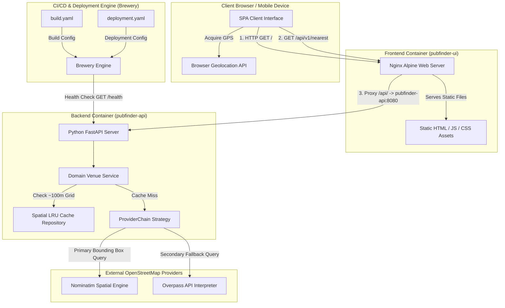
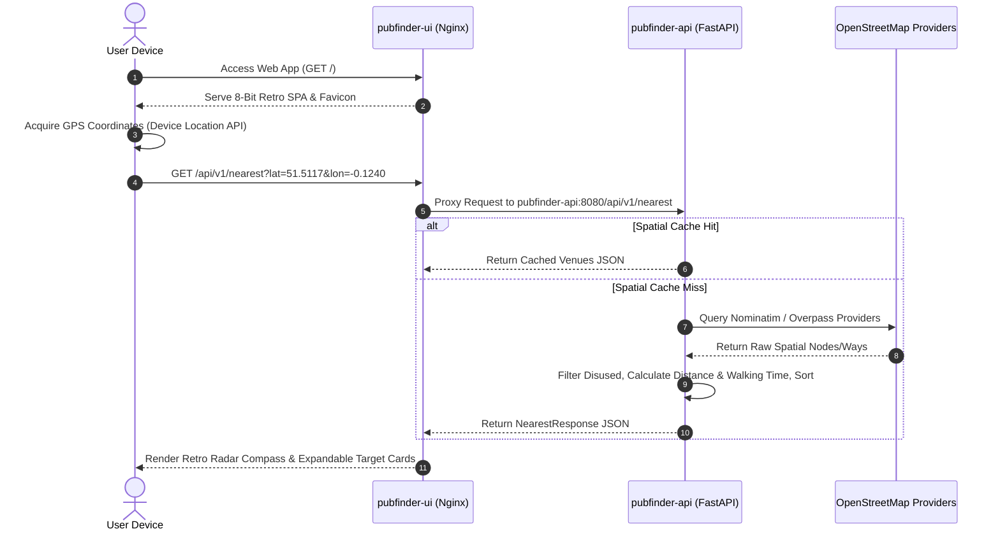

# PubFinder System Architecture

This document provides a high-level architectural summary of the entire **PubFinder (Beerdar)** platform, illustrating how the frontend Single Page Application (SPA), backend API service, caching layers, external geospatial providers, container environment, and Brewery CI/CD deployment engine operate together as a unified ecosystem.

---

## 🛰️ High-Level System Architecture Diagram

---

## 🧩 Architectural Layers & System Components

### 1. User Interface & Edge Layer (`pubfinder-ui`)
- **Technology Stack**: Svelte 4, TypeScript, TailwindCSS v4, and Lucide Icons.
- **Visual Design**: 8-bit retro light-mode arcade aesthetic utilizing Google Fonts (*Silkscreen* and *Press Start 2P*), hard 3D pixel drop shadows, and 4px solid black border framing.
- **PWA Service Worker**: Registered via `vite-plugin-pwa` with `skipWaiting` and `clientsClaim` for instant deployment updates.
- **Web Server & Reverse Proxy**: Hosted inside an Nginx Alpine container (Port `4002` host / `80` container). Serves static HTML/JS/CSS assets with `no-cache` headers for HTML/Service Worker files and proxies `/api/` traffic internally to `pubfinder-api:8080`.

---

### 2. Backend Application & Processing Layer (`pubfinder-api`)
- **Technology Stack**: Python 3.11, FastAPI, Pydantic v2, and `httpx`.
- **Modular Software Design**:
  - **Strategy Pattern (`ProviderChain`)**: Encapsulates external data provider logic, prioritizing OpenStreetMap Nominatim bounding-box queries (~0.25s response time) and falling back to Overpass API interpreter queries.
  - **Repository Pattern (`SpatialLRUCacheRepository`)**: Implements grid-based spatial caching by rounding user coordinates to 3 decimal places (~100m grid cell) with 15-minute TTL invalidation.
  - **Domain Service Layer (`VenueService` & `GeoService`)**: Normalizes address structures, filters non-drinking establishments or disused venues, calculates Haversine distances and walking times, and sorts venues by proximity.
- **Async Lifespan Connection Pooling**: Manages a shared `httpx.AsyncClient` socket connection pool across the application lifecycle to minimize TCP handshake overhead.

---

### 3. External Geospatial Integrations
- **OpenStreetMap Nominatim**: Primary provider querying spatial amenity nodes and building polygon ways.
- **OpenStreetMap Overpass API**: Secondary fallback provider querying raw node/way elements when primary queries time out or yield no results.
- **Google Maps**: Generates direct destination navigation URLs (`https://www.google.com/maps/dir/?api=1&destination={lat},{lon}`) for user routing.

---

### 4. CI/CD Pipeline & Homelab Orchestration (Brewery)
- **Container Build Specifications (`build.yaml`)**:
  - Configures artifact compilation patterns for `pubfinder-api` (`backend/Dockerfile`) and `pubfinder-ui` (`frontend/Dockerfile`).
- **Deployment Specifications (`deployment.yaml`)**:
  - Defines service mapping, host port bindings (`4001:8080` for API, `4002:80` for UI), rolling deployment strategies, automatic failure rollbacks, and explicit HTTP health check monitoring (`GET /health`).

---

## 🔄 End-to-End Data Flow

---

## 🛠️ Verification & Health Monitoring

- **API Health Check Endpoint**: `GET /health` returns JSON `{"status": "healthy", "service": "pubfinder-api", "timestamp": "..."}`.
- **UI Health Check Endpoint**: `GET /` returns `200 OK` HTML index page.
- **Stateless Operation**: The platform requires no persistent database, relying entirely on real-time spatial ingress and in-memory spatial grid caching.
